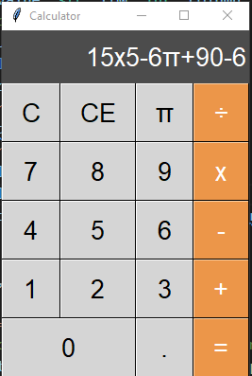
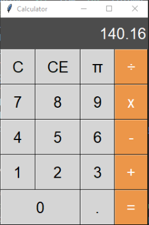

# Calculator

A simple calculator GUI built with Python and Tkinter.

## Requirements

* Python 3.x
* Tkinter (included in Python standard library)

## Usage

To run the calculator, simply execute the `calculator.py` file:

```
python calculator.py
```

The calculator GUI will appear on your screen. Use the buttons to enter expressions and perform calculations.

## Screenshots




## Features

* Basic arithmetic operations: addition, subtraction, multiplication, and division
* Clear button to reset the calculator
* Backspace button to delete the last character
* Supports decimal numbers and parentheses
* Calculates expressions using Python's `eval()` function
* Handles errors and displays an error message if the expression is invalid
